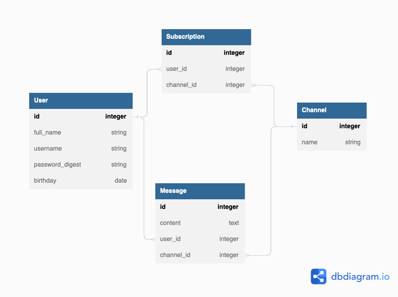

# Flatiron School - FLEX SE - Phase 5 - Project - ReactCord

## Description

This project is to fulfill the requirements for Phase 5 of the Flatiron School - Flex SE program. 
This project is created with a React Frontend and Rails Backend, and is setup to be deployed to Render for hosting. 
You can view the complete application hosted on Render at: [Link to project](https://reactcord.onrender.com)

ReactCord is an attempt to replicate the popular application known as Discord. 
ReactCord is in the early stages of development and will lack the full features of the actual Discord application.
ReactCord utilizes the `ActionCable` library from Rails as a requirement to create a websocket connection between the frontend and the backend for real-time updates.

## Current Features
- Create a user account
- Login as a user
- Create a chat channel
- Subscribe to an existing chat channel
- Send message(s) across the chat channel
- Real-time updates of new messages for a particular channel

## Database Model
The following is a diagram of the Database model used for the backend.




## Requirements (Local Machine)

- Ruby 2.7.4
- NodeJS (v16), and npm
- Postgresql

## Usage (Local Machine)

### Install Dependencies:

```sh
bundle install
rails db:create
npm install --prefix client
```

### Running Locally

You can use the following commands to run the application:

- `rails s`: run the backend on [http://localhost:3000](http://localhost:3000)
- `npm start --prefix client`: run the frontend on
  [http://localhost:4000](http://localhost:4000)

  
### Install Postgresql

ReactCord is currently configured for PostgreSQL as the database. If you don't already have it installed,
you'll need to set it up.

#### PostgreSQL Installation for WSL

To install Postgres for WSL, run the following commands from your Ubuntu terminal:

```sh
sudo apt update
sudo apt install postgresql postgresql-contrib libpq-dev
```

Then confirm that Postgres was installed successfully:

```sh
psql --version
```

Run this command to start the Postgres service:

```sh
sudo service postgresql start
```

Finally, you'll also need to create a database user so that you are able to
connect to the database from Rails. First, check what your operating system
username is:

```sh
whoami
```

If your username is "ian", for example, you'd need to create a Postgres user
with that same name. To do so, run this command to open the Postgres CLI:

```sh
sudo -u postgres -i
```

From the Postgres CLI, run this command (replacing "ian" with your username):

```sh
createuser -sr ian
```

Then enter `control + d` or type `logout` to exit.

[This guide][postgresql wsl] has more info on setting up Postgres on WSL if you
get stuck.

[postgresql wsl]: https://docs.microsoft.com/en-us/windows/wsl/tutorials/wsl-database#install-postgresql

#### Postgresql Installation for OSX

To install Postgres for OSX, you can use Homebrew:

```sh
brew install postgresql
```

Once Postgres has been installed, run this command to start the Postgres
service:

```sh
brew services start postgresql
```

### Using SQLite
Alternatively you can re-configure this application to use SQLite instead of Postgres, by doing the following changes:
1. In the `Gemfile`, replace `gem 'pg', '~> 1.1'` with `gem 'sqlite3', '~>
   1.4'`.
2. In the `database.yml` file, change the line `adapter: postgresql` to
   `adapter: sqlite3`.

## Future Implementations
- Direct messages (DMs) to another user
- Show user status - online and offline

## References

- [CSS used for ReactCord](https://github.com/CleverProgrammers/discord-clone-blockchain)
- [CSS used for ReactCord Buttons](https://codepen.io/chrisharper22/pen/abvBRBr)

